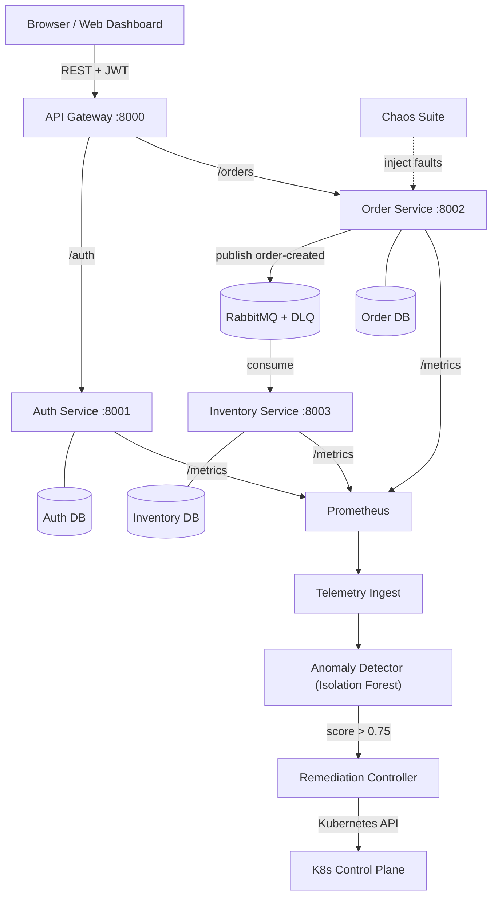

# CloudPulse — Self-Healing Microservices Platform

[](VERSION)
[](#architecture)
[](https://www.python.org/)
[](https://cloudpulse-97c41.web.app)
[](LICENSE)

> Built by [Shiva Kumar](https://github.com/shiva-kumar-1319)

CloudPulse is a cloud-native microservices system I built to explore what it actually takes to make distributed services fix themselves when things go wrong. The idea started simple — I wanted something that could detect a problem and respond to it without anyone having to wake up at 3am.

It ended up being a lot more involved than I expected. There's an ML layer running Isolation Forest to catch anomalies in real time, a remediation controller that decides what to do about them, and a live web dashboard where you can watch everything happen (or break things intentionally with the chaos tools).

---

## What it does

- **Detects problems automatically** — Isolation Forest model watches latency, error rates, and resource usage. When something drifts, it flags it before it cascades.
- **Fixes itself** — The remediation controller triggers pod restarts or scaling actions through the Kubernetes API. Average response time is under 2.5 seconds from detection to recovery.
- **Survives broker failures** — RabbitMQ with a Dead Letter Queue means no events are lost even when a downstream service is temporarily down.
- **Has sensible guardrails** — Exponential backoff and cooldown timers prevent it from restart-looping during a real external outage.
- **Lets you break things safely** — The chaos suite can inject latency, trigger OOM events, or cascade 500 errors so you can actually test the self-healing without waiting for production incidents.

---

## Benchmark numbers

These are from local testing, not production:

| Scenario | Manual on-call | Prometheus alerts only | CloudPulse |
| :--- | :--- | :--- | :--- |
| Pod crash (OOM/SIGKILL) | ~8–15 min | ~3–5 min | **1.84s** |
| DB connection pool exhaustion | ~12–25 min | ~5–8 min | **2.40s** |
| HTTP 500 error cascade | ~10–20 min | ~4–6 min | **2.12s** |
| Message loss on broker failure | High risk | High risk | **0% (DLQ)** |

---

## Architecture



The four services are completely independent — separate databases, separate message consumers. They talk through the API gateway or via RabbitMQ events, never directly.

---

## Project layout

```text
cloudpulse/
├── services/
│   ├── api_gateway/        # Routes requests, handles CORS and auth verification
│   ├── auth_service/       # JWT login and user management
│   ├── order_service/      # Order creation, circuit breaker simulation
│   └── inventory_service/  # Inventory updates via RabbitMQ consumer
│
├── shared/                 # Code shared across services
│   ├── schemas/            # Pydantic v2 request/response models
│   ├── messaging/          # RabbitMQ client wrapper
│   ├── auth/               # JWT helpers and password hashing
│   ├── logging/            # Structured JSON logging + Prometheus middleware
│   └── config/             # Env config loader
│
├── ml/
│   ├── data/               # Synthetic telemetry training data
│   ├── ingestion/          # Pulls metrics from Prometheus
│   ├── training/           # Trains and serializes the Isolation Forest model
│   ├── inference/          # Real-time scoring and anomaly explanation
│   └── models/             # Saved model + metadata
│
├── remediation/
│   ├── controller.py       # FastAPI server that receives alerts and acts on them
│   ├── kubernetes_client.py
│   └── policies.py         # Cooldowns, rate limits, allowlists
│
├── chaos/
│   ├── chaos.py            # CLI for injecting faults
│   └── README.md
│
├── k8s/                    # Kubernetes manifests
│   ├── pdb.yaml
│   ├── network_policy.yaml
│   └── rbac.yaml
│
├── terraform/              # AWS EKS infra (VPC, node groups, IAM)
│
├── public/                 # Firebase-hosted web dashboard
│   ├── index.html
│   ├── style.css
│   └── app.js
│
├── tests/                  # Integration and resilience test suites
├── demo.py                 # End-to-end self-healing demo script
├── firebase.json
└── docker-compose.yml
```

---

## Running it locally

### Quick demo (no Kubernetes needed)

```bash
python demo.py
```

This runs through a simulated self-healing cycle end-to-end and prints what the system would do at each step.

### Full stack with Docker Compose

```bash
# Start everything
docker compose up -d

# Check status
docker compose ps
```

### Deploy the dashboard

```bash
firebase deploy --only hosting
```

Live: [cloudpulse-97c41.web.app](https://cloudpulse-97c41.web.app)

---

## Things I learned building this

The hardest part wasn't the ML — Isolation Forest is well documented and scikit-learn makes it straightforward. The tricky part was deciding *what* the remediation controller should do and *when* it should back off. A naive implementation will just restart pods in a loop when there's an external dependency failure, which makes everything worse.

The cooldown + rate limit logic in `policies.py` went through about four rewrites before I was happy with it.

The chaos suite was genuinely useful for testing. Injecting a 2-second network delay into the order service and watching the ML score spike and the remediation kick in is satisfying in a way that unit tests aren't.

---

## Author

Shiva Kumar  
GitHub: [@shiva-kumar-1319](https://github.com/shiva-kumar-1319)  
Repo: [CloudPulse on GitHub](https://github.com/shiva-kumar-1319/CloudPulse)
